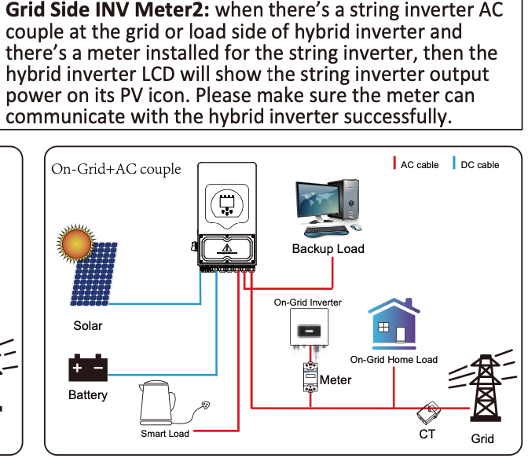
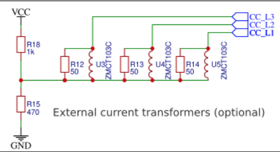
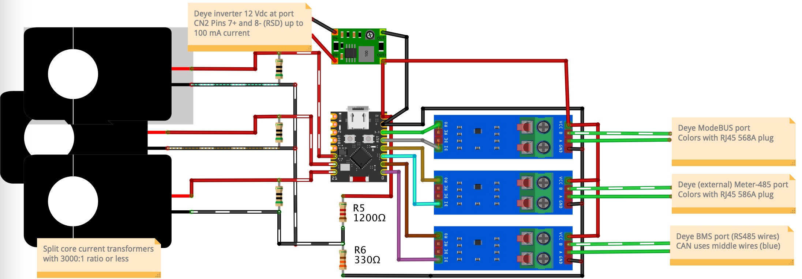
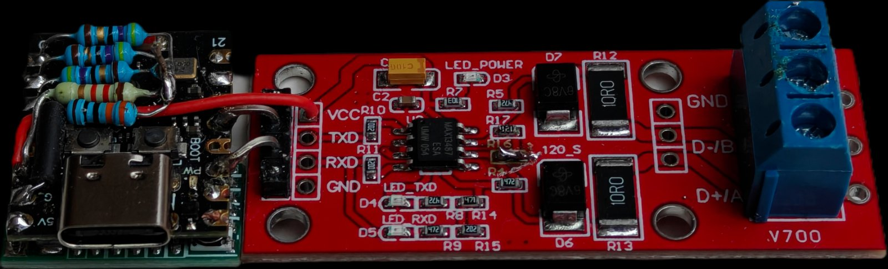
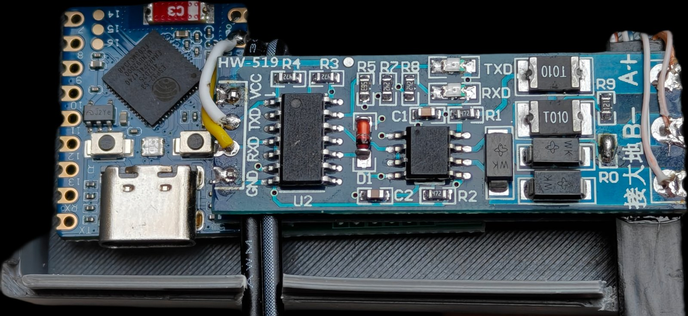

## ESPHome Fake Eastron SDM630 Modbus v2 with CTs
[![GitHub Activity][commits-shield]][commits]
[![Last Commit][last-commit-shield]][commits]
[![Platform][platform-shield]](https://github.com/esphome)

This project [kosl/esphome-fake-eastron-SDM630-with-CTs](https://github.com/kosl/esphome-fake-eastron-SDM630-with-CTs) allows you to provide live data from current transformers (CTs) to a solar inverter that expects an [Eastron SDM630](https://www.eastroneurope.com/products/view/sdm630modbus).

Such example is Deye inverter

We will use ESP32-C3 SuperMini board with addition of "external" CTs and few resistors as shown below 

Since this will be installed in SUN-12K-SG04LP3 inverter we will also 
add local [Modbus dongle](https://github.com/rosenrot00/esphome_modbus_bridge)  
for use in [Solarman](https://github.com/davidrapan/ha-solarman) integration.

## How is this working?

The project provides an ESPhome component acting as a server that can be polled by a master (e.g. a solar inverter) via Modbus RTU. It behaves as much as possible like the Eastron SDM630 while fetching the actual data from the CTs.

### How exactly?

* On boot, the ESPhome starts a Modbus slave on address 2. This is where Deye expects to find the vanilla Eastron SDM630 Modbus V2. It registers several input registers that can be queried by a Modbus master.
* At 1s intervals, it makes a request to CTs fetching live data.
* CT values are parsed and converted to IEEE-754 float and written to the matching registers.
* Voltages for each phase can be calibrated from Deye inverter through Modbus or by Home Assistant integration.
* The inverter queries the Modbus slave several times a second, fetching the input registers in various groups.

## Why?

I use a SUN-12K-SG04LP3-EU hybrid inverter. The inverter only supports two types of smart meters, which must be connected via RS485:

* Eastron SDM630 Modbus V2 or V3
* CHINT DTSU666 smart meter 

In my case the inverter is installed less than 15m from the grid connection. 

Since the ESP32-C3 is very cheap this simple ESPhome project bridges manufacturer, distance, physical layer and protocol.

## Implementation
For implementation the cheapest ESP32-C3 Super Mini module (€2.5-€4), some resistors, and RS485 to TTL module(s) are required.
Compete cost is under €10 excluding costs of CTs that can be various (cheap, split-core, different ratios, accuracy,...)

### Burden resistor

ESP32-C3 at 6dB attenuation can measure up to 1350 mV. Middle voltage is 675 mV.
If having CT with ratio 1:3000 that at 35A primary one gets 0.01167 A at secondary. 
Burden resistor should not be larger than R_max = 0.675/0.01167 = 57 Ohm.
Therefore we select R = 47 Ohm that is somewhat compatible with UTP cable.

For getting middle voltage 0.675 V from 3.3 V divisor by selecting lower R6 at 330Ω 
the upper R5 is (3.3-0.675)/(0.675/330)=1283Ω and therefore we select 1K2 resistor. 

## Installation

1. Connect ESP32 dev board to RS485 module.
2. Connect RS485 A and B connectors to pins 5 (A) and 4 (B) of the Deye RJ45 Port for RS 485.
3. Build and flash the firmware based on the [sample ESPhome config](./fake-eastron.yaml).
4. Calibrate ADCs to correspond Deye CTs readings. For this CTs should be placed in serial with Deye CTs and both should show the same currents on all phases.
5. Enable meter-reading in Deye  **TODO: explain how**

All 4 modules (supermini, stepdown regulator below, and RS485 module stacked) 
with resistors for the CTs bridge shown below.

Note that some RS485 modules have TXD and RXD marked reversed (`tx_pin` is connected to TXD).

When more virtual devices are needed then ESP32-S3 zero is recommended that has 3 UARTS and can host Solaredge Modbus/TCP client fetching directly from the inverter or Modbus/RTU for direct Solaredge coupling.

### Modbus address and registers

Deye expects different smart meters at different slave addresses:

| Meter | Phases | Slave address |
|---------|----------|-----------------|
| Eastron SDM630 v2 | 3 | 1 |
| Eastron SDM630 v2 | 3 | 2 |

The "Grid Tie Meter2" expects "Eastron" slave at address 0x01. If that is not available it tries also address 0x02 after 10 retries. Therefore, it is recommended to use slave address 0x01 for the meter.

Requests from "Grid Tie Meter2" port are issued for 3 Phase Power registers (0x000C, 0x000E, 0x0010) every 0.17 seconds (6 Hz frequency) and energy register 0x0048 "Import Wh since last reset" (being 0 Wh) with 0x004A "Export Wh since last reset" every 1.86 seconds.

### Module configurations

1. [deye-bridge.yaml](deye-bridge.yaml) - Solaredge Modbus/TCP to Eastron SDM630 with Moddbus/TCP->RTU bridge for HA-Solarman
2. [example-modbus-server.yaml](example-modbus-server.yaml) Testing two TTL-Modbus/RTU modules in client/server (master/slave) coupling.
3. [modbus-bridge.yaml](modbus-bridge.yaml) Testing Modbus TCP to RTU bridge.
4. [deye-esphome.yaml](deye-esphome.yaml) Testing Modbus port on Deye SUN-12K SG04LP3
5. [fake-eastron-example.yaml](fake-eastron-example.yaml) Example of Eastron with CTs for Deye Meter2 (incomplete). Mapping for voltage can be fixed (230 V) or can be provided from source such as Deye or other inverter.
6. [solarege-to-eastron-example.yaml](solarege-to-eastron-example.yaml) Energy meter example that has two RS485 modules to verify communication from SolarEdge inverter that translates to fake SDM630 meter acting as a slave (server). Another RS485 uses standard ESPHome SDM meter component to read as a master (client) the data provided from fake SDM630 meter.

## External documentation & tools
* [Eastron SDM630 Modbus Protocol](docs/SDM630-Modbus_Protocol.pdf)
* [Eastron modbus register maps for SDM120 to SDM630](https://www.aggsoft.com/modbus-data-logging/eastron.htm)
* [ESP32 NodeMCU pinout](docs/ESP-32_NodeMCU_Developmentboard_Pinout.pdf)
* [IEEE-754 Floating Point Converter](https://www.h-schmidt.net/FloatConverter/IEEE754.html)
* [Online Modbus Parse](https://rapidscada.net/modbus/)
* Python tool to query an Eastron; for testing/verification: [https://github.com/nmakel/sdm_modbus](https://github.com/nmakel/sdm_modbus)
* [ESPHome current clamp sensor](https://esphome.io/components/sensor/ct_clamp)
* [ESPHome ADC sensor](https://esphome.io/components/sensor/adc)
* [ESPHome for Deye](https://github.com/klatremis/esphome-for-deye)
* [ESP32-C3 Super Mini Plus](https://www.espboards.dev/esp32/esp32-c3-super-mini-plus/)
* [Modbus bridge for Solarman](https://github.com/rosenrot00/esphome_modbus_bridge)  
* [ESPHome PACE BMS](https://github.com/syssi/esphome-pace-bms/)

[releases-shield]: https://img.shields.io/github/v/release/kosl/esphome-fake-eastron-SDM630-with-CTs
[commits-shield]: https://img.shields.io/github/commit-activity/m/kosl/esphome-fake-eastron-SDM630-with-CTs
[last-commit-shield]: https://img.shields.io/github/last-commit/kosl/esphome-fake-eastron-SDM630-with-CTs
[platform-shield]: https://img.shields.io/badge/platform-ESPHome-blue

[releases]: https://github.com/kosl/esphome-fake-eastron-SDM630-with-CTs/releases
[commits]: https://github.com/kosl/esphome-fake-eastron-SDM630-with-CTs/commits/main
